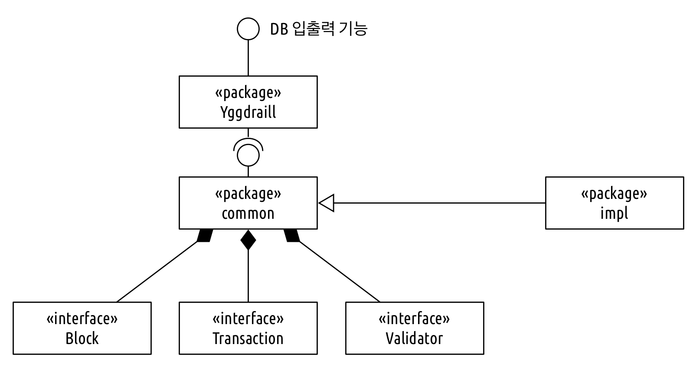
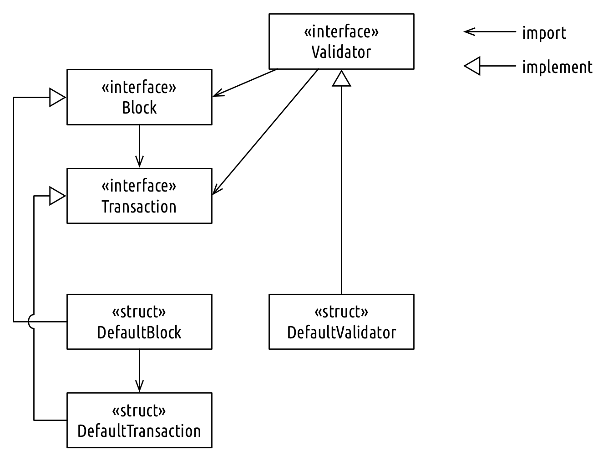

# 디자인 방향

Yggdrasill은 블록을 DB에 저장, 관리하는 기능을 제공하는 라이브러리이다. 그렇기 때문에, 블록을 실제로 Key Value DB에 쓰고,
트랜잭션 ID, 블록 Height, 블록 Hash 값 등으로 관련 블록을 읽는 등의 DB 입출력 기능을 제공한다. 즉, 기본적으로 블록을 위한 DB 라이브러리라고 볼 수 있다.

Yggdrasill의 주요한 목표는 **블록, 트랜잭션, 벨리데이터(Validator)에 대한 기본적인 인터페이스를 제시하고, 이 인터페이스를 구현한 구조체(struct)는 어떤 구조체든지 Yggdrasill의 DB 입출력 기능을 사용할 수 있도록 하는 것**이다.

# 구현

현재 Yggdrasill에서 제공하는 DB 입출력 기능은 다음과 같다. 그리고 `common` 패키지에는 블록, 트랜잭션, 벨리데이터에 대한 기본 인터페이스가 정의되어 있는데, 앞서 말한대로, 이 인터페이스를 구현한 구조체들은 아래 입출력 기능을 이용해서 DB에 쓰고 읽을 수 있다.

```go
AddBlock(block common.Block) error
GetBlockByHeight(block common.Block, height uint64) error
GetBlockBySeal(block common.Block, seal []byte) error
GetLastBlock(block common.Block) error
GetTransactionByTxID(transaction common.Transaction, txID string) error
GetBlockByTxID(block common.Block, txID string) error
```

여기에 더해서, Yggdrasill 구조체는 [`github.com/DE-labtory/leveldb-wrapper`](https://github.com/DE-labtory/leveldb-wrapper) 프로젝트의 `key_value_db` 패키지의 `KeyValueDB` 인터페이스를 구현한 DB 구조체는 어떤 것이든 백엔드 DB 구현체로 사용할 수 있다.

그리고 `impl` 패키지에는 이 인터페이스들을 구현한 구조체가 구현되어 있다. 일종의 예시이면서, 동시에 `it-chain-Engine`에서 사용될 것을 고려하여 구현되었다.

## 구조



`yggdrasill` 패키지는 오직 `common` 패키지만을 참조하며, `impl` 패키지에는 의존성을 갖고 있지 않다. `common` 패키지에는 `Block`, `Transaction`, `Valdiator` 인터페이스가 정의되어 있고, `impl` 패키지는 `common` 패키지를 구현한 구현체이다. `yggdrasill` 패키지의 기능들이 `impl` 패키지의 실제 구현체들과 함께 사용되는 모습은 `yggdrasill_test.go` 파일에서 참조할 수 있다. 물론 `impl` 패키지의 구현체를 사용하지 않고, 직접 `common` 인터페이스를 구현한 구현체를 사용할 수 있다. 그게 바로 Yggdrasill 라이브러리의 목표이다.



인터페이스 수준에서는 `Block`은 `Transaction`을, `Validator`는 `Block`과 `Transaction`에 의존관계를 갖고 있다. 하지만, 이들의 구체적인 구현체가 꼭 이 의존관계를 가질 필요는 없다. 예를 들어, `DefaultValidator`는 `DefaultBlock`과 `DefaultTransaction`에 의존관계를 갖고 있지 않다. 이 말은 `DefaultValidator`는 `Block`, `Transaction` 인터페이스를 구현한 모든 종류의 구조체에 동작할 수 있음을 의미한다. 하지만 `DefaultBlock`은 `DefaultTransaction`에 의존관계를 갖고 있다. 그렇기 때문에 만약 `DefaultBlock`을 이용한다면, 반드시 `DefaultTransaction`도 사용해야 한다. 반대의 경우는 성립하지 않는다.

## 용어

Yggdrasill 라이브러리는 구체적인 구현체에 대해 유연함을 갖기 위해 블록체인에서 de-facto standard로 사용되는 용어 몇개를 의도적으로 피했다. 그 리스트는 다음과 같다.

* Seal: Seal은 '인장, 봉인'이라는 뜻으로, 대상(블록, 또는 트랜잭션들)이 위변조가 되지 않았음을 보장하는 값을 의미한다. 현재 일반적인 블록체인들은 Hash를 이용한다. `impl` 패키지의 구현체들도 Hash 값을 Seal 값으로 사용하도록 구현되어 있다. 하지만 나중에 더 좋은 방식이 나오거나, 사정에 따라 Hash 대신 다른 방법(비록 약하더라도)을 사용하고자 하는 개발자가 있을 수 있으므로  Seal이라는 기술 중립적인 용어를 사용했다. `Seal` 값의 생성과 검증은 `Validator`가 담당한다.
  * `TxSeal`: 흔히 머클트리가 맡고 있는 역할을 동일하게 수행한다. `impl` 패키지의 구현체도 머클트리로 구현되어 있다.

# 예제

현재 사용 예제들은 따로 준비하진 않았다. 앞으로 문서에 추가할 예정이다. 하지만 현재도 `_test.go` 파일들에서 간접적으로 확인할 수 있다.